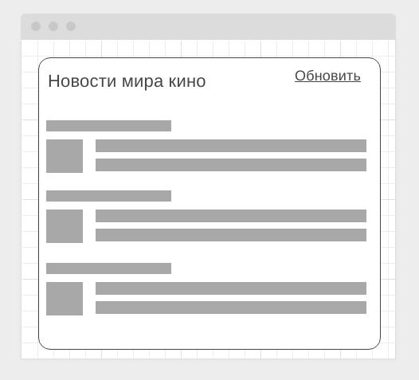

https://github.com/AlexWEBArt/AHJ-Loading-Styling-frontend.git/

### Loading Styling

#### Легенда

Сейчас модно показывать интерфейсы загрузки вроде следующего:

#### Описание

Реализуйте подобный интерфейс, закешировав статические ресурсы и показывая данный внешний вид до момента загрузки данных.

Обратите внимание, даже если у пользователя нет подключения, страница всё равно должна отображаться, но в режиме "загрузки" и после неудачной попытки соединения переходить в режим:

Для эмуляции задержки можете самостоятельно написать middleware для koa, или посмотреть на существующие вроде [koa-slow](https://github.com/bahmutov/koa-slow)

Напоминаем, что для кэширования вы можете воспользоваться плагином Workbox.